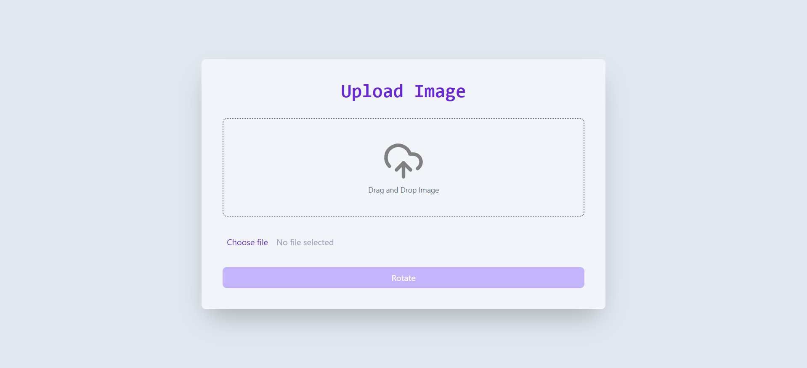

# Image Rotation Web Application

This project is a simple web application that allows users to upload an image, which is then rotated 90 degrees on the server side and sent back to the client for display.

## Project Structure

- [`server/`]: Node.js backend server
   - [`app.js`]: Main server file
   - `uploads/`: Directory for storing uploaded images
- [`client/`]: React frontend application
  - [`src/`]: Source files for the React application
    - [`App.tsx`]: Main React component
    - [`main.tsx`]: Entry point for the React application
    - [`index.css`]: Global CSS styles
  - `public/`: Public assets
  - [`package.json`]: Client dependencies and scripts
  - [`tailwind.config.js`]: Tailwind CSS configuration
  - `tsconfig.json`: TypeScript configuration
  - [`vite.config.ts`]: Vite configuration

## Setup Instructions

### Backend

1. Navigate to the server directory:
   ```sh
   cd server
   ```

2. Install dependencies:
   ```sh
   npm install
   ```

3. Start the server:
   ```sh
   npm run dev
   ```

The server will run on [`http://localhost:3000`] .

### Frontend

1. Navigate to the client directory:
   ```sh
   cd client
   ```

2. Install dependencies:
   ```sh
   npm install
   ```

3. Start the React development server:
   ```sh
   npm run dev
   ```

The frontend will run on `http://localhost:5173`.



## Usage

1. Open your browser and go to `http://localhost:5173`.
2. Use the file input to select an image or just drag and drop Image.
3. Click the "Rotate" button to upload and rotate the image.
4. The rotated image will be displayed on the page.

## Technologies Used

- Backend: Node.js, Express, Sharp, Multer
- Frontend: React, Axios, Tailwind CSS, Vite

## Error Handling

The application includes basic error handling for file uploads and image processing. Error messages will be displayed to the user if something goes wrong.

## Styling

The frontend uses Tailwind CSS for styling. You can enhance the styling by modifying the CSS in the React components or the Tailwind configuration.

## Building

To build the project, run:
```sh
npm run build
```
